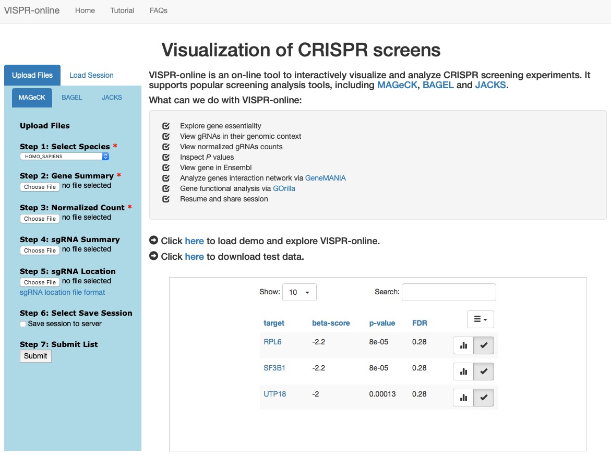

# VISPR-online
VISPR-online is a web-based interactive framework for CRISPR screens visualization, exploration and sharing.

#### Table of Contents
1. [Description](#Description)
2. [Installation](#Installation)
3. [Demo Test](#Demo)
4. [License](#License)
5. [Contact](#Contact)

<a name="Description"></a>
I. Description
----
VISPR-online is a web-based interactive framework for CRISPR screens visualization, exploration and sharing.

CRISPR screen is an exciting technology to identify the functions of coding genes and non-coding genes in various contexts. We previously developed VISPR, bundled with [MAGeCK](https://www.ncbi.nlm.nih.gov/pubmed/26673418), an interactive framework to visualize CRISPR screening results in a local computer. However, VISPR only supports output of MAGeCK, and requires manual installation and configuration. To overcome these limitations, we developed VISPR-online, a web-based server for the visualization of CRISPR screening.

Compared with VISPR, VISPR-online provides more useful functions:

* Interactive gene essentiality exploration.
* Support more popular CRISPR screening analysis tools, including [MAGeCK](https://pubmed.ncbi.nlm.nih.gov/25476604/), [BAGEL](https://pubmed.ncbi.nlm.nih.gov/27083490/) and [JACKS](https://pubmed.ncbi.nlm.nih.gov/30674557/).
* View gRNAs in their genomic context.
* Provide retrieving and sharing session functions.
* Installation and configuration free.

Users can either use VISPR-online from the public server, or create their own servers based on VISPR-online source codes.

<a name="Installation"></a>
II. Installation
----
VISPR-online can also be installed in a local computer or network for internal use.

### Step1:
Download VISPR-online source code.

```
$ git clone https://github.com/lemoncyb/VISPR-online.git
```

### Step2:
Install Python 3. Please refer to [Python websit](https://www.python.org/downloads/).

### Step3:
Install related Python dependencies.

```
$ pip install flask
$ pip install pymongo
$ pip install PyYAML
$ pip install numpy
$ pip install pandas==0.19.1
$ pip install sklearn
```

<a name="Demo"></a>
III. Demo test
----
### Step1:
Launch VISPR-online server.

Enter the top directory of VISPR-online. Execute the following script:

```
$ ./run.py
```

Open your browser and access <http://127.0.0.1:5000>. You will see the following page if successful.

 

### Step2:
A demo is integrated in VISPR-online repository. You could click the demo link on home page to load the project and explore the results.

### Step3:
A test dataset is contained in VISPR-online repository. The path is ```VISPR-online/vispr_screen/static/data/testdata.zip```.

Upload corresponding files to VISPR-online. Then click the "Submit" button to explore the results. The results pages are like this.

  

<a name="License"></a>
License
----
Licensed under the [MIT license](http://opensource.org/licenses/MIT). This project may not be copied, modified, or distributed except according to those terms.

<a name="Contact"></a>
Contact
----
Yingbo Cui <yingbocui@nudt.edu.cn>
